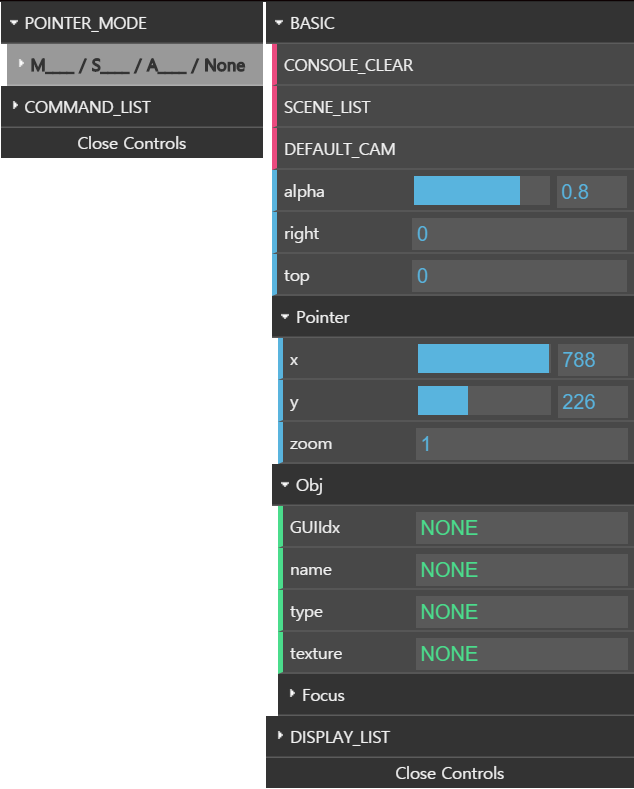
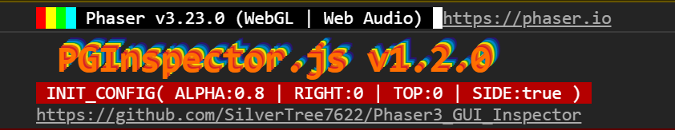
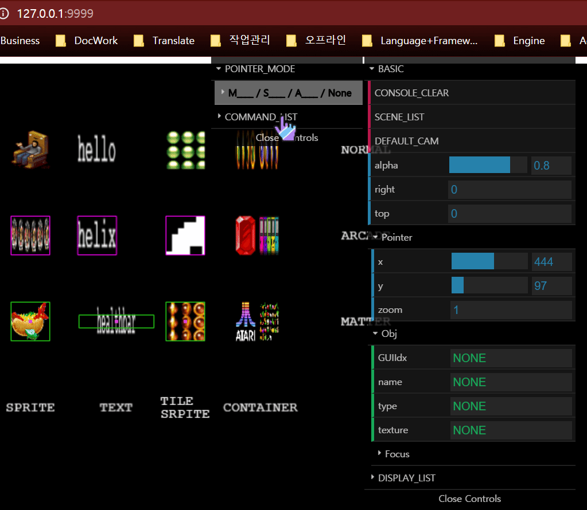

# Phaser3_GUI_Inspector (PGInspector.js)

**WARNING)**\
&nbsp;&nbsp;&nbsp;&nbsp;This is the only for phaser3 framework

**DESCRIPTION)**\
&nbsp;&nbsp;&nbsp;&nbsp;I just inspired by babylon.js inspector\
&nbsp;&nbsp;&nbsp;&nbsp;This is a just custom dat.GUI, which works as Phaser3 inspector of each display list stuffs \
&nbsp;&nbsp;&nbsp;&nbsp;Also you can use this as debug displayed game objects

**SCREENSHOT)**

  

**EXAMPLE)**\
&nbsp;&nbsp;&nbsp;&nbsp;**NODE_JS)** - it has a issue so not recommended right now
	
	npm install phaser3_gui_inspector --save-dev
	npm i phaser3_gui_inspector --save-dev
	
	// set in javascript file
	import PhaserGUIAction from 'phaser3_gui_inspector';
	
&nbsp;&nbsp;&nbsp;&nbsp;**IN_HTML_URL)** - prefer this method to test
	
	// latest version
	
	// previous version
	

&nbsp;&nbsp;&nbsp;&nbsp;**IN_JS)**

	function create() {
		/*
		* your any codes
		*/
		
		// should call this function at the end of Phaser.Scene create function
		// below method is gonna apply with default detailed setting
		PhaserGUIAction(this);
		
		// or
		
		// add some custom config object
		// first index is Phaser.Scene, second is config object
		PhaserGUIAction(
			this,
			{
				alpha: 0.6, // 0.0 ~ 1.0 (any value, you can change it in GUI)
				right: 100, // any value
				top: 50 // any value
				side: true // boolean (default is true)
			}
		);
	}

&nbsp;&nbsp;&nbsp;&nbsp;&nbsp;&nbsp;&nbsp;&nbsp;or

	// your custom Phaser.Scene class
	class MainScene extends Phaser.Scene {
		preload() {
			/*
			* your any codes
			*/
		}
		create() {
			/*
			* your any codes
			*/
			
			PhaserGUIAction(this); // also config object one works
		}
	}

&nbsp;&nbsp;&nbsp;&nbsp;**IN_DEVTOOLS)**\
&nbsp;&nbsp;&nbsp;&nbsp;&nbsp;&nbsp;&nbsp;&nbsp;It has some info in console way
	

  

**USAGE)**\
&nbsp;&nbsp;&nbsp;&nbsp;mouse command : \
&nbsp;&nbsp;&nbsp;&nbsp;&nbsp;&nbsp;&nbsp;&nbsp;(SHIFT + F) or (SHIFT + LEFT CLICK) is the most important & basic command for controlling Game Objects\
&nbsp;&nbsp;&nbsp;&nbsp;&nbsp;&nbsp;&nbsp;&nbsp;This makes Game Object 'Focus' which twinkles with RED BOUND\
&nbsp;&nbsp;&nbsp;&nbsp;&nbsp;&nbsp;&nbsp;&nbsp;The others is on the command list like below

	

&nbsp;&nbsp;&nbsp;&nbsp;You can find command list in the Side GUI (init option 'side' should be true)

**WARNING)**\
&nbsp;&nbsp;&nbsp;&nbsp;&nbsp;&nbsp;&nbsp;&nbsp;- You can find specific Game Object via opening DISPLAY_LIST\
&nbsp;&nbsp;&nbsp;&nbsp;&nbsp;&nbsp;&nbsp;&nbsp;but i recommend to use command because performance optimization is based on the command actions

**VERSION)**\
&nbsp;&nbsp;&nbsp;&nbsp;**PREVIOUS_UPDATE)** https://github.com/SilverTree7622/Phaser3_GUI_Inspector/tree/master/zUpdate

&nbsp;&nbsp;&nbsp;&nbsp;**1.2.0)**\
&nbsp;&nbsp;&nbsp;&nbsp;&nbsp;&nbsp;&nbsp;&nbsp;- Add Pointer Mode for ease (Move, Scale, Angle, None)\
&nbsp;&nbsp;&nbsp;&nbsp;&nbsp;&nbsp;&nbsp;&nbsp;&nbsp;&nbsp;Related Commands are (SHIFT + Q, W, E, R) for changing Pointer Mode & control with (SHIFT + LEFT CLICK)

	

&nbsp;&nbsp;&nbsp;&nbsp;&nbsp;&nbsp;&nbsp;&nbsp;- Add Camera Move & Zoom\
&nbsp;&nbsp;&nbsp;&nbsp;&nbsp;&nbsp;&nbsp;&nbsp;&nbsp;&nbsp;Related Commands are (SHIFT + RIGHT CLICK) & (SHIFT + MOUSE SCROLL) & (SHIFT + S)

	

&nbsp;&nbsp;&nbsp;&nbsp;&nbsp;&nbsp;&nbsp;&nbsp;- Add Following Focused Game Object\
&nbsp;&nbsp;&nbsp;&nbsp;&nbsp;&nbsp;&nbsp;&nbsp;&nbsp;&nbsp;Related Commands (SHIIFT + A) following or stop toggling when focused

	

&nbsp;&nbsp;&nbsp;&nbsp;&nbsp;&nbsp;&nbsp;&nbsp;- Improve performance via partially hide

&nbsp;&nbsp;&nbsp;&nbsp;&nbsp;&nbsp;&nbsp;&nbsp;- Add Focus on/off toggle in detail

&nbsp;&nbsp;&nbsp;&nbsp;&nbsp;&nbsp;&nbsp;&nbsp;- Add Focus Game Object visible toggle\
&nbsp;&nbsp;&nbsp;&nbsp;&nbsp;&nbsp;&nbsp;&nbsp;&nbsp;&nbsp;Related Commands (SHIIFT + V) when focused

&nbsp;&nbsp;&nbsp;&nbsp;&nbsp;&nbsp;&nbsp;&nbsp;- Add Focus Game Object's detail\
&nbsp;&nbsp;&nbsp;&nbsp;&nbsp;&nbsp;&nbsp;&nbsp;&nbsp;&nbsp;Related Commands (SHIIFT + D) when focused

&nbsp;&nbsp;&nbsp;&nbsp;&nbsp;&nbsp;&nbsp;&nbsp;- Add Main Camera Blue Boundary only when move, zoom or following active

&nbsp;&nbsp;&nbsp;&nbsp;&nbsp;&nbsp;&nbsp;&nbsp;- Add Default Zoom function which is just same as (SHIFT + S)

**SHOWCASE)**\
&nbsp;&nbsp;&nbsp;&nbsp;- mix with focused(SHIFT + F) + following(SHIFT + A) + Pointer Move Mode(SHIFT + Q)

	

&nbsp;&nbsp;&nbsp;&nbsp;- test same thing in mini game

	

