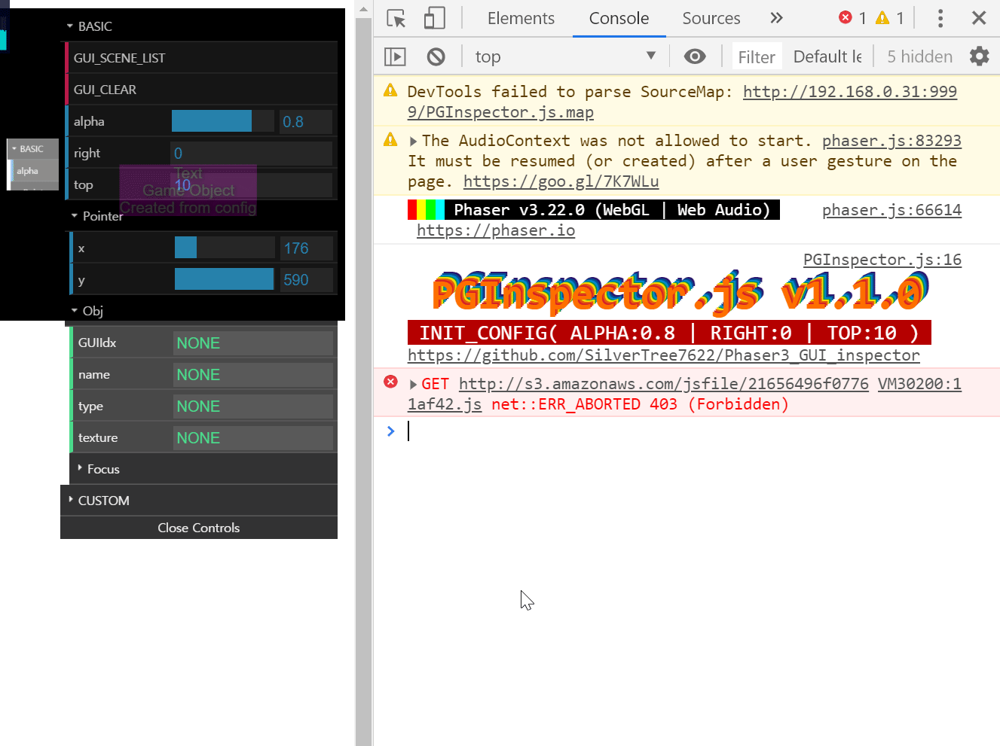

# Phaser3_GUI_inspector (PGInspector.js)

**WARNING)**\
&nbsp;&nbsp;&nbsp;&nbsp;This is only for phaser3 framework

**DESCRIPTION)**\
&nbsp;&nbsp;&nbsp;&nbsp;I just inspired by babylon.js inspector\
&nbsp;&nbsp;&nbsp;&nbsp;This is a just custom dat.GUI, which works as Phaser3 inspector of each display list stuffs \
&nbsp;&nbsp;&nbsp;&nbsp;Also you can use this as debug displayed game objects

**SCREENSHOT)**

  

**EXAMPLE)**\
&nbsp;&nbsp;&nbsp;&nbsp;**NODE_JS)**
	
	npm install phaser3_gui_inspector
	npm i phaser3_gui_inspector
	
&nbsp;&nbsp;&nbsp;&nbsp;**IN_HTML_URL)**
	
	

&nbsp;&nbsp;&nbsp;&nbsp;**IN_JS)**

	function create() {
		/*
		* your any codes
		*/
		
		// should call this function at the end of Phaser.Scene create function
		// below method is gonna apply with default detailed setting
		PhaserGUIAction(this);
		
		// or
		
		// add some custom config object
		// first index is Phaser.Scene, second is config object
		PhaserGUIAction(
			this,
			{
				alpha: 0.6, // 0.0 ~ 1.0 (any value, you can change it in GUI)
				right: 100, // any value
				top: 50 // any value
			}
		);
	}

&nbsp;&nbsp;&nbsp;&nbsp;&nbsp;&nbsp;&nbsp;&nbsp;or

	// your custom Phaser.Scene class
	class MainScene extends Phaser.Scene {
		preload() {
			/*
			* your any codes
			*/
		}
		create() {
			/*
			* your any codes
			*/
			
			PhaserGUIAction(this); // also config object one works
		}
	}

&nbsp;&nbsp;&nbsp;&nbsp;&nbsp;&nbsp;&nbsp;&nbsp;If you wanna check this GUI class

	console.log('window.PhaserGUI:', window.PhaserGUI);

&nbsp;&nbsp;&nbsp;&nbsp;**IN_DEVTOOLS)**\
&nbsp;&nbsp;&nbsp;&nbsp;&nbsp;&nbsp;&nbsp;&nbsp;It has some info in console way
	

  

**USAGE)**\
&nbsp;&nbsp;&nbsp;&nbsp;mouse command :\
&nbsp;&nbsp;&nbsp;&nbsp;&nbsp;&nbsp;&nbsp;&nbsp;click phaser game object with\
&nbsp;&nbsp;&nbsp;&nbsp;&nbsp;&nbsp;&nbsp;&nbsp;**(Mouse middle button) or (Shift + F) or (Shift + Left Click)**\
&nbsp;&nbsp;&nbsp;&nbsp;if you wanna check the focused game object console, then\
&nbsp;&nbsp;&nbsp;&nbsp;&nbsp;&nbsp;&nbsp;&nbsp;**(Shift + C) or (just click the name "GUI_CONSOLE") when the game object focused**\
&nbsp;&nbsp;&nbsp;&nbsp;(if it's not already focused, then focus on it\
&nbsp;&nbsp;&nbsp;&nbsp;else is focus off the object)

	

> **If you wanna check status or var name somethning,**\
> **then change Phaser GameObject name property**\
> **PGInspector will detect and show on UI**

**NOTATION)**\
&nbsp;&nbsp;&nbsp;&nbsp;At the beginnnig, I just use this only for my phaser project\
&nbsp;&nbsp;&nbsp;&nbsp;But, I changed my mind at the middle of this work so I made this as open source project\
&nbsp;&nbsp;&nbsp;&nbsp;This is kind of side project so if I got some feedback,\
&nbsp;&nbsp;&nbsp;&nbsp;then I'll fix or add via requests
  
**PLAN)**\
&nbsp;&nbsp;&nbsp;&nbsp;**TO DO)**\
&nbsp;&nbsp;&nbsp;&nbsp;&nbsp;&nbsp;&nbsp;&nbsp;Update DebugBox when user change focus object properties\
&nbsp;&nbsp;&nbsp;&nbsp;&nbsp;&nbsp;&nbsp;&nbsp;Set smooth detailed folder converts when user change focus object\
&nbsp;&nbsp;&nbsp;&nbsp;**ADD ANOTHER)**\
&nbsp;&nbsp;&nbsp;&nbsp;&nbsp;&nbsp;&nbsp;&nbsp;Add kind of GAME_STATUS_MANAGER stuffs with another dependency JS Lib\
&nbsp;&nbsp;&nbsp;&nbsp;&nbsp;&nbsp;&nbsp;&nbsp;if I finish GAME_STATUS_MANAGER, I also publish Merged PGInspector & GAME_STATUS_MANAGER Lib
    
**VERSION)**\
&nbsp;&nbsp;&nbsp;&nbsp;**1.1.0)**\
&nbsp;&nbsp;&nbsp;&nbsp;&nbsp;&nbsp;&nbsp;&nbsp;- TEXTURE, FRAME, ANIMATION CONTROL

	
	

&nbsp;&nbsp;&nbsp;&nbsp;&nbsp;&nbsp;&nbsp;&nbsp;- SHOW FOCUSED GAME OBJECT CONSOLE

	

&nbsp;&nbsp;&nbsp;&nbsp;&nbsp;&nbsp;&nbsp;&nbsp;- SHOW SCENE, DISPLAYLIST & CONSOLE.CLEAR FUNCTION

	

