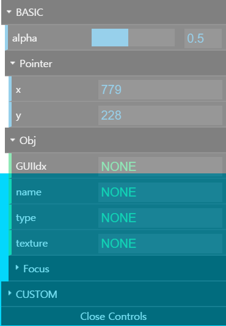
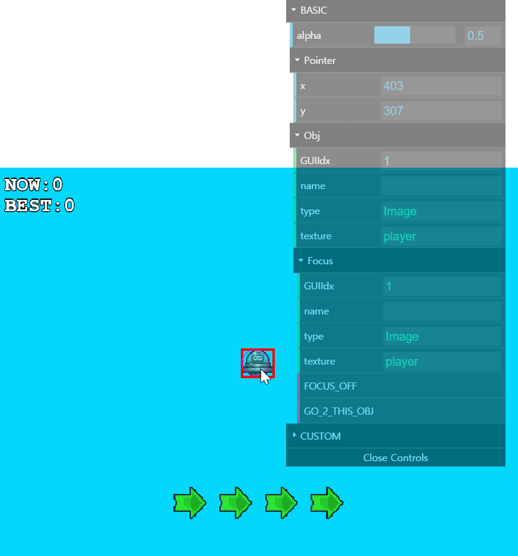

# Phaser3_GUI_inspector (PGInspector.js)

**WARNING)**\
&nbsp;&nbsp;&nbsp;&nbsp;This is only for phaser3 framework

**DESCRIPTION)**\
&nbsp;&nbsp;&nbsp;&nbsp;I just inspired by babylon.js inspector
&nbsp;&nbsp;&nbsp;&nbsp;This is a just custom dat.GUI, which works as Phaser3 inspector of each display list stuffs \
&nbsp;&nbsp;&nbsp;&nbsp;Also you can use this as debug displayed game objects

**SCREENSHOT)**

  

**EXAMPLE)**\
&nbsp;&nbsp;&nbsp;&nbsp;**IN_HTML_URL)**\
&nbsp;&nbsp;&nbsp;&nbsp;&nbsp;&nbsp;&nbsp;&nbsp;https://cdn.jsdelivr.net/gh/SilverTree7622/Phaser3_GUI_inspector@latest/dist/PGInspector.min.js \
&nbsp;&nbsp;&nbsp;&nbsp;&nbsp;&nbsp;&nbsp;&nbsp;https://cdn.jsdelivr.net/gh/SilverTree7622/Phaser3_GUI_inspector@1.0.5/dist/PGInspector.min.js \
&nbsp;&nbsp;&nbsp;&nbsp;**IN_JS)**

	function create() {
		/*
		* your any codes
		*/
		
		// should call this function at the end of Phaser.Scene create function
		// default detailed setting will be applied
		PhaserDatActionWithScene(this);
		
		// or
		
		// add some custom config object
		PhaserDatActionWithScene({
			scene: this, //
			alpha: 0.6 // 0.0 ~ 1.0 (anyvalue, you can change it in GUI)
		});
	}
**USAGE)**\
&nbsp;&nbsp;&nbsp;&nbsp;mouse command : *click phaser game object with **mouse middle button***\
&nbsp;&nbsp;&nbsp;&nbsp;(if is not already focused, then focus on it\
&nbsp;&nbsp;&nbsp;&nbsp;else is focus off the object)

> **If you wanna check status or var name somethning,**\
> **then change Phaser GameObject name property**\
> **PGInspector will detect and show on UI**

**NOTATION)**\
&nbsp;&nbsp;&nbsp;&nbsp;At the beginnnig, I just use this only for my phaser project\
&nbsp;&nbsp;&nbsp;&nbsp;But, I changed my mind at the middle of this lib so I made it as open source project\
&nbsp;&nbsp;&nbsp;&nbsp;This is kind of side project so if I got some feedback,\
&nbsp;&nbsp;&nbsp;&nbsp;then I'll fix or add via requests
  
**PLAN)**\
&nbsp;&nbsp;&nbsp;&nbsp;**ADD ANOTHER)**\
&nbsp;&nbsp;&nbsp;&nbsp;&nbsp;&nbsp;&nbsp;&nbsp;Add kind of GAME_STATUS_MANAGER stuffs with another dependency JS Lib\
&nbsp;&nbsp;&nbsp;&nbsp;&nbsp;&nbsp;&nbsp;&nbsp;if I finish GAME_STATUS_MANAGER, I also publish Merged PGInspector & GAME_STATUS_MANAGER Lib
    
