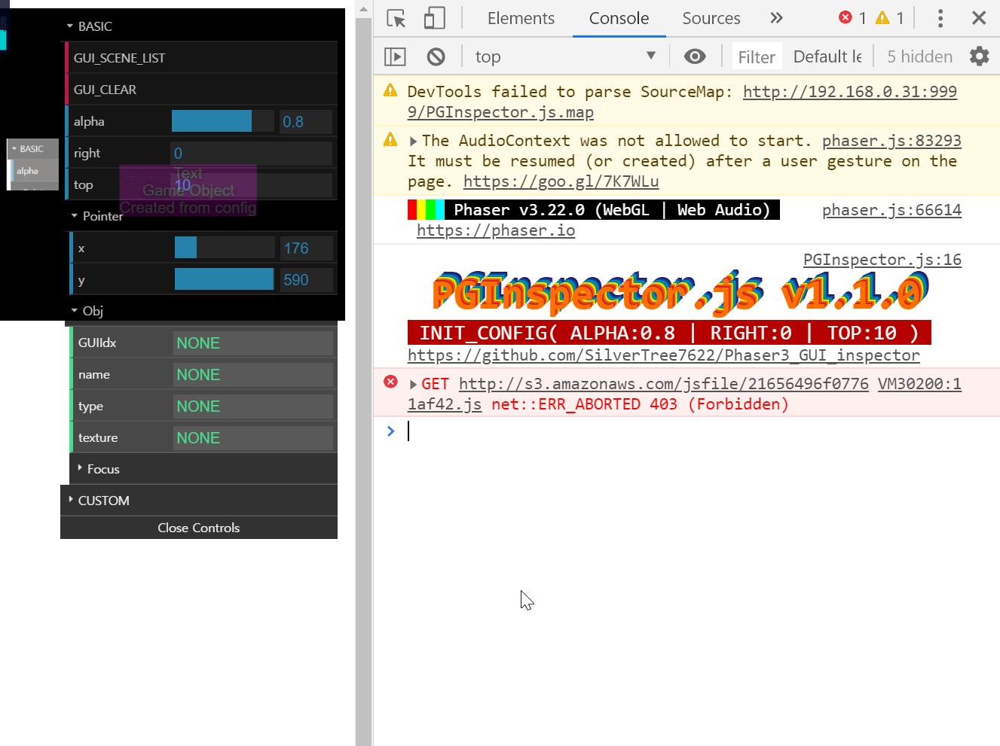
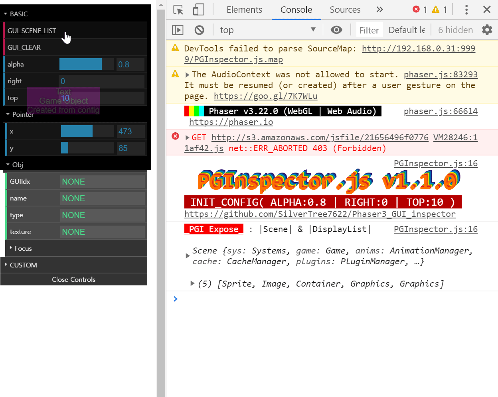

**VERSION)**\
&nbsp;&nbsp;&nbsp;&nbsp;**1.1.0)**\
&nbsp;&nbsp;&nbsp;&nbsp;&nbsp;&nbsp;&nbsp;&nbsp;- TEXTURE, FRAME, ANIMATION CONTROL

	
	

&nbsp;&nbsp;&nbsp;&nbsp;&nbsp;&nbsp;&nbsp;&nbsp;- SHOW FOCUSED GAME OBJECT CONSOLE

	

&nbsp;&nbsp;&nbsp;&nbsp;&nbsp;&nbsp;&nbsp;&nbsp;- SHOW SCENE, DISPLAYLIST & CONSOLE.CLEAR FUNCTION

	

